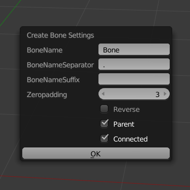

# Create Bone Based On Edge

## :warning:Warning:warning:

Blender 2.8以降対応バージョンを『Petit Armature Tools』としてリリースしました。
下記のリポジトリを参照してください。

Blender 2.8 or later compatible version has been released as "Petit Armature Tools".
Please refer to the repository below.

https://github.com/samia-done/Petit-Armature-Tools

## Description

「Create Bone Based On Edge」は、Blender 2.79b用のアドオンです。
選択したエッジに基づいて新しいボーンを作成します。

"Create Bone Based On Edge" is an add-on to Blender 2.79b.
Creates a new bone based on the selected edge.

## Download

画面右上にある［Clone or download］ ＞ ［Dwonload ZIP］の順にクリックして、Zipファイルをダウンロードしてください。

"Clone or download" > "Dwonload ZIP"

## Install

1. ダウンロードしたZipファイルを解凍します。
1. Blenderの［ユーザー設定］画面を開きます。
1. ［アドオン］タブにある［ファイルからアドオンをインストール］ボタンを押して、解凍したフォルダ内にある［create_bone_based_on_edge.py］ファイルを選択しインストールします。
1. 画面左にある［サポートレベル］ > ［テスト中］を押して、テスト中のアドオンを表示します。
1. ［Create Bone Based On Edge］の左にあるチェックをつけて、アドオンを有効にします。

---

1. Unzip a file.
1. Open User Preferences.
1. Select the Add-ons tab and press Install Addon and Select the "create_bone_based_on_edge.py" file.
1. Press Support Level > "Testing" on the left side of the screen to display the add-on under test.
1. Enable the "Create Bone Based On Edge" Addon.

## Usage

3Dビュー > 編集モード で［辺選択］を有効にし［Ctrl + E］キーを押すと、以下の3つのメニューが追加されています。

Enable "Edge select" in 3D view > Edit mode, Pressing Ctrl + E adds the following three menus.

### Create Bone From Edge

選択した辺の位置に新しいボーンを作成します。

Creates a new bone from the selected edge location

#### Demo1

#### Note1

Ctrl + Clickや、Alt + Clickで選択した辺などは1つとしてカウントされます。Shift + Click で複数の辺を選択するようにしてください。

Edges selected with Ctrl + Click or Alt + Click are counted as one. Make sure to select multiple edges with Shift + Click.

### Create Bone From Edge Loops Midpoint

2つ以上選択したエッジループの中点にボーンを作成します。

Creates a new bone from the midpoints of two or more selected edge loops.

#### Demo2

### Create Bone Settings

ボーンの設定ダイアログを表示します。  
作成されるボーンの名前、親子関係の有無、ボーンの接続の有無などを変更できます。

［ユーザー設定］画面 > ［アドオン］タブ > ［Create Bone Based On Edge］の［ユーザー設定:］にも同様の設定項目があります。  
デフォルト設定を保存しておきたい場合には、［ユーザー設定］画面で［ユーザー設定の保存］を行ってください。

Display the bone setting dialog.  
You can change the bone's name, whether it is a parent-child relationship, and whether there is a bone connection.

#### BoneName

ボーンの名前を入力します。

Enter the name of the bone.

#### BoneNameSeparator

ボーンの名前に使用する区切り文字を入力します。  
ボーン名には自動で割り振られる連番の数字があり、ボーン名とその数字の間や、後述する接尾語との間に区切り文字を使用します。

入力例：「.」「_」「-」など。

Enter the delimiter used for bone names.  
The bone names are assigned consecutive numbers, and a separator is used between the bone name and the number and suffix.

example：".","_","-"... etc

#### BoneNameSuffix

ボーンの名前の後につけ加える文字（接尾語）を入力します。必要がなければ空のままで良いです。

入力例：「L」「Left」「R」「Right」など。

Enter the letter (suffix) to be added after the bone's name.  
You can leave it empty if you do not need it.

example："L","Left","R","Right"... etc

#### Zeropadding

ボーン名に自動で割り振られる連番の数字の桁数を入力します。  
入力された桁数に足りない場合、数字の左側をゼロ埋めします。  
「0」を入力した場合は「1」となりゼロ埋めを行いません。

入力例：「3」の場合は「001」、「5」の場合は「00001」など。

Please enter the number of digits in the number.
If the number of digits entered is insufficient, zeros are padded to the left of the number.
If you enter "0", "1" is not zero-padded.

example："3" is "001" ,"5" is "00001"... etc

#### Reverse

「Create Bone From Edge」を使用時に、先頭のボーンの向きを反転します。  
作成されたボーンの向きがおかしいときには、チェックを入れたり外したりして調整してみてください。

When using "Create Bone From Edge", reverse the direction of the first bone.
If the direction of the bone you created is incorrect, check or uncheck and adjust.

#### Parent

一つ前に作成されたボーンを、親ボーンをセットします。  
ボーンに親子関係をもたせたくない場合は、チェックを外してください。

Set the bone created one ago as a parent bone.  
Turn this off if you do not want the bones to have a parent-child relationship.

#### Connected

ボーンを接続します。  
ボーンを接続したくない場合は、チェックを外してください。

Connect the bones.  
If you do not want to connect the bones, please uncheck.

## Licence

[GPL License](./LICENCE)

## Author

GitHub:[Samia](https://github.com/samia_done)  
Twitter:[@samia_done](https://twitter.com/samia_done)
